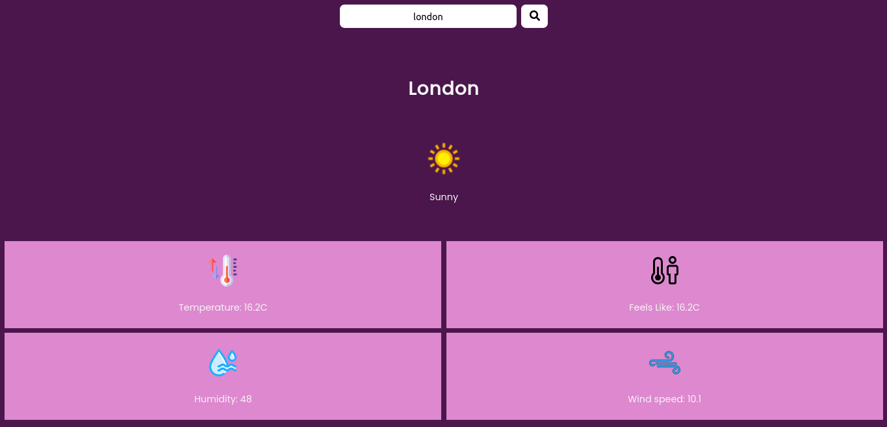

# Weather App

A simple react weather app which displays the current weather of a city.


## Demo


Click here to see it live [https://lamweather.netlify.app/](https://lamweather.netlify.app/)

## Features

- Allows a user to enter city name and display current weather of that city.

- Mobile responsive design

- Displays information like current temperature, windspeed, humidity, and feels like temperature


## How to Use

1. Open the live demo link.
2. Enter city name you want to see the current weather condition.
3. Press Enter or click on the search button.
4. The information will be displayed instantly.

## Screenshots


## Tech Stack

**Client:** React, CSS

## API Reference

This project uses the [WeatherAPI](https://www.weatherapi.com/) to fetch weather data.

### How to Use

1. Sign up at [WeatherAPI](https://www.weatherapi.com/) to get you API key.

2. Replace `YOUR_API_KEY` in the code with your actual API key.
## Run Locally

Clone the project

```bash
  git clone https://github.com/Lamphrangmi-Lamin/react-weather-app.git
```

Go to the project directory

```bash
  cd react-weather-app
```

Install dependencies

```bash
  npm install
```

Start the server

```bash
  npm run dev
```


## Environment Variables

To run this project, you will need to add the following environment variables to your .env file

`VITE_WEATHER_API_KEY=your_api_key`


## Deployment

We used [Netlify](app.netlify.com) for Deployment.